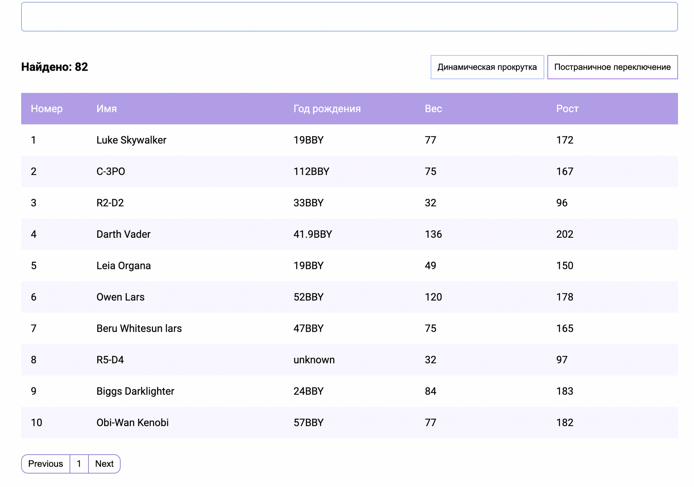

# Тестовое

Небольшое приложение по поиску и отображению персонажей. Состоит из строки поиска, счетчика общего количества, переключателей и самой таблицы.

Должен быть реализован следующий функционал:

1. При первичной загрузке грузится список персонажей.
2. Предусмотреть переключатель на постраничную подгрузку или подгрузку персонажей при скролле.
3. Строка поиска. При вводе от 3-х символов должны отображаться персонажи соответсвующие строке или если ничего не найдено, то сообщение в теле таблицы. Предусмотреть очистку поля и отображение полного списка

Рекомендации:

1. Стилизация на чистом css или scss. Не использовать никаких UI-библиотек. Верстка на гридах и флексах. Будет плюсом если будет адаптив.
2. API - [https://swapi.dev/](https://swapi.dev/)
3. Код разместить на GitHub или Gitlab

# Bvb

This project was generated with [Angular CLI](https://github.com/angular/angular-cli) version 14.2.7.

## Development server

Run `ng serve` for a dev server. Navigate to `http://localhost:4200/`. The application will automatically reload if you change any of the source files.

## Code scaffolding

Run `ng generate component component-name` to generate a new component. You can also use `ng generate directive|pipe|service|class|guard|interface|enum|module`.

## Build

Run `ng build` to build the project. The build artifacts will be stored in the `dist/` directory.

## Running unit tests

Run `ng test` to execute the unit tests via [Karma](https://karma-runner.github.io).

## Running end-to-end tests

Run `ng e2e` to execute the end-to-end tests via a platform of your choice. To use this command, you need to first add a package that implements end-to-end testing capabilities.

## Further help

To get more help on the Angular CLI use `ng help` or go check out the [Angular CLI Overview and Command Reference](https://angular.io/cli) page.
